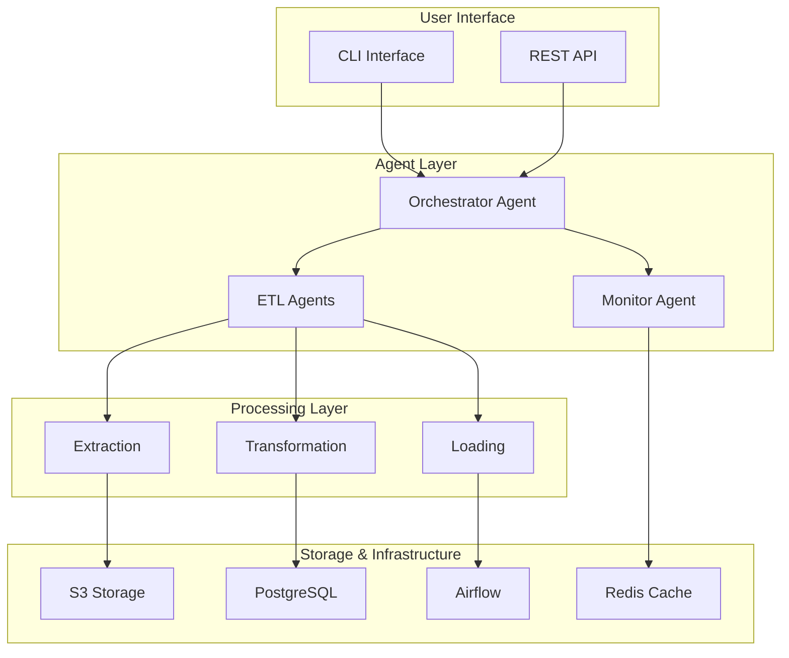

# Architecture Overview

## System Design

Agent-Orchestrated-ETL is a hybrid system that combines Apache Airflow's workflow orchestration capabilities with LangChain's intelligent agent framework to create self-optimizing data pipelines.

### Core Components

### Agent Architecture

#### Orchestrator Agent
- **Responsibility**: Analyzes data sources and orchestrates pipeline creation
- **Capabilities**: 
  - Data source discovery and analysis
  - Pipeline optimization based on data characteristics
  - Dynamic DAG generation
  - Resource allocation decisions

#### ETL Agents
- **Extraction Agent**: Handles data ingestion from various sources
- **Transformation Agent**: Applies data transformations and quality checks
- **Loading Agent**: Manages data persistence and indexing

#### Monitor Agent
- **Responsibility**: Real-time pipeline monitoring and optimization
- **Capabilities**:
  - Performance metrics collection
  - Error detection and recovery
  - Resource usage optimization
  - Alert generation

### Data Flow

1. **Source Analysis**: Orchestrator agent analyzes incoming data source
2. **Pipeline Design**: Agent generates optimal pipeline structure
3. **Execution**: ETL agents execute pipeline steps
4. **Monitoring**: Monitor agent tracks performance and health
5. **Optimization**: Agents adapt pipeline based on performance data

### Technology Stack

- **Core Framework**: Python 3.8+
- **Agent Framework**: LangChain
- **Workflow Engine**: Apache Airflow
- **Data Processing**: Pandas, PyArrow
- **Storage**: S3, PostgreSQL
- **Monitoring**: Custom metrics + Prometheus integration
- **Configuration**: YAML-based configuration system

### Scalability Considerations

- **Horizontal Scaling**: Multiple agent instances with load balancing
- **Vertical Scaling**: Dynamic resource allocation based on pipeline complexity
- **Caching**: Redis-based caching for frequently accessed metadata
- **Queue Management**: Celery for distributed task processing

### Security Architecture

- **Authentication**: Token-based API authentication
- **Authorization**: Role-based access control (RBAC)
- **Data Encryption**: In-transit and at-rest encryption
- **Secret Management**: AWS Secrets Manager integration
- **Audit Logging**: Comprehensive audit trail for all operations

### Performance Characteristics

- **Throughput**: Designed for high-volume data processing
- **Latency**: Low-latency pipeline generation and execution
- **Reliability**: Built-in circuit breakers and retry mechanisms
- **Observability**: Comprehensive metrics and logging

## Deployment Architecture

### Development Environment
- Local development with Docker Compose
- Hot-reload for rapid iteration
- Integrated testing environment

### Staging Environment
- Mirror of production infrastructure
- Automated deployment pipeline
- Performance testing suite

### Production Environment
- Multi-zone deployment for high availability
- Auto-scaling based on load
- Disaster recovery procedures
- Blue-green deployment strategy

## Future Considerations

- **Machine Learning Integration**: ML-based pipeline optimization
- **Multi-cloud Support**: AWS, GCP, Azure compatibility
- **Streaming Support**: Real-time data processing capabilities
- **Federated Learning**: Distributed model training across data sources