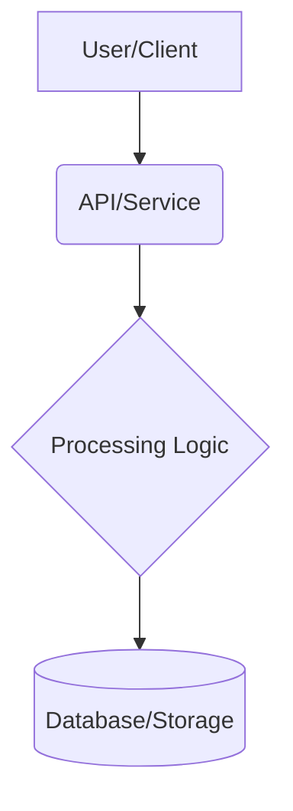

# Codebase Overview (2025-06-22)

## 1. Project Purpose
Agent-Orchestrated-ETL

## 2. Key Components & Architecture
*This section should be populated after a more detailed analysis of the source code.*
- **Languages & Frameworks:** *TBD*
- **Data Storage:** *TBD*
- **Orchestration:** *TBD*

### Architecture Diagram (Placeholder)

## 3. Next Steps
The immediate priority is to flesh out the development plan and begin implementing the core features.
