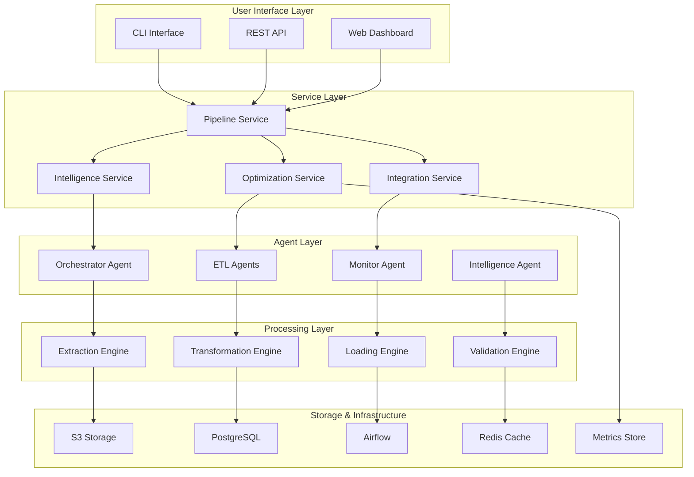

# Enhanced Architecture Documentation

## System Design Evolution

The Agent-Orchestrated-ETL system has been enhanced with comprehensive business logic services and intelligent optimization capabilities.

### Enhanced Core Components

## Enhanced Services Architecture

### 1. Pipeline Service
**Core Business Logic Hub**
- **Intelligent Pipeline Creation**: Automatic optimization based on data source analysis
- **Execution Orchestration**: Comprehensive monitoring with real-time metrics
- **Quality Validation**: Integrated data quality scoring and validation
- **Performance Tracking**: Detailed execution metrics and optimization suggestions
- **Error Recovery**: Intelligent retry mechanisms with circuit breaker patterns

**Key Features:**
- Dynamic pipeline configuration optimization
- Real-time execution monitoring
- Automated quality assessment
- Performance bottleneck identification
- Intelligent error handling and recovery

### 2. Intelligence Service
**AI-Driven Decision Making**
- **Requirement Analysis**: Intelligent analysis of pipeline requirements
- **Performance Prediction**: ML-based execution time and resource predictions
- **Optimization Recommendations**: Context-aware optimization suggestions
- **Pattern Learning**: Continuous learning from execution patterns
- **Risk Assessment**: Predictive failure risk analysis

**Key Features:**
- Data source characteristic analysis
- Business requirement interpretation
- Performance prediction models
- Intelligent recommendation engine
- Continuous learning capabilities

### 3. Optimization Service
**Real-time Performance Tuning**
- **Strategy Selection**: Adaptive optimization strategy selection
- **Resource Optimization**: Dynamic resource allocation and scaling
- **Performance Monitoring**: Real-time performance bottleneck detection
- **Cost Optimization**: Intelligent cost vs. performance trade-offs
- **Adaptive Tuning**: Real-time parameter adjustment

**Key Features:**
- Multiple optimization strategies (performance, cost, quality, balanced)
- Real-time adaptation capabilities
- Resource utilization monitoring
- Performance trend analysis
- Cost-benefit optimization

### 4. Integration Service
**External System Connectivity**
- **Multi-Protocol Support**: Database, API, file system, cloud storage integrations
- **Intelligent Retry**: Exponential backoff with circuit breaker patterns
- **Rate Limiting**: Configurable rate limiting for external APIs
- **Health Monitoring**: Connection health tracking and automatic recovery
- **Bulk Operations**: Efficient batch processing for notifications and data transfers

**Key Features:**
- Universal connector architecture
- Circuit breaker pattern implementation
- Rate limiting and throttling
- Connection pooling and reuse
- Comprehensive error handling

## Data Flow Architecture

### Enhanced Pipeline Execution Flow

1. **Intelligent Analysis Phase**
   - Source characteristic analysis
   - Business requirement interpretation
   - Optimization strategy selection
   - Resource requirement prediction

2. **Dynamic Configuration Phase**
   - Optimized configuration generation
   - Resource allocation planning
   - Quality validation setup
   - Monitoring configuration

3. **Monitored Execution Phase**
   - Real-time performance monitoring
   - Dynamic optimization adjustments
   - Quality validation checkpoints
   - Error detection and recovery

4. **Learning and Optimization Phase**
   - Performance pattern analysis
   - Optimization effectiveness evaluation
   - Model updates and improvements
   - Recommendation generation

## Advanced Features

### Intelligent Optimization
- **Adaptive Strategies**: Dynamic strategy selection based on conditions
- **Real-time Tuning**: Live parameter adjustment during execution
- **Pattern Recognition**: Learning from historical execution patterns
- **Predictive Scaling**: Proactive resource scaling based on predictions

### Quality Assurance
- **Comprehensive Validation**: Multi-layer data quality validation
- **Real-time Scoring**: Continuous quality score calculation
- **Anomaly Detection**: Automated detection of data quality issues
- **Quality Trends**: Historical quality tracking and trend analysis

### External Integration
- **Universal Connectors**: Support for major data sources and destinations
- **Resilient Connections**: Circuit breaker and retry patterns
- **Bulk Operations**: Efficient batch processing capabilities
- **Health Monitoring**: Continuous connection health tracking

## Performance Characteristics

### Scalability Improvements
- **Horizontal Scaling**: Multi-instance deployment with load balancing
- **Vertical Scaling**: Dynamic resource allocation based on workload
- **Caching Strategy**: Multi-level caching for performance optimization
- **Async Processing**: Non-blocking operations with async/await patterns

### Reliability Enhancements
- **Circuit Breakers**: Automatic failure isolation and recovery
- **Retry Mechanisms**: Intelligent retry with exponential backoff
- **Health Checks**: Comprehensive system health monitoring
- **Graceful Degradation**: Fallback mechanisms for service failures

### Observability Features
- **Comprehensive Metrics**: Detailed performance and business metrics
- **Real-time Monitoring**: Live dashboard with key performance indicators
- **Intelligent Alerting**: Context-aware alert generation
- **Performance Analytics**: Historical performance analysis and trends

## Security Architecture

### Enhanced Security Features
- **Multi-layer Authentication**: Token-based and credential-based auth
- **Secure Configuration**: Environment-based secret management
- **Audit Logging**: Comprehensive audit trail for all operations
- **Data Encryption**: In-transit and at-rest encryption support

## Future Architecture Considerations

### Machine Learning Integration
- **Advanced Prediction Models**: ML-based performance and quality prediction
- **Automated Optimization**: Self-optimizing pipelines based on ML insights
- **Anomaly Detection**: ML-powered anomaly detection capabilities
- **Intelligent Routing**: ML-based data routing and processing decisions

### Cloud-Native Features
- **Multi-cloud Support**: Seamless operation across cloud providers
- **Serverless Integration**: Support for serverless computing patterns
- **Container Orchestration**: Kubernetes-native deployment and scaling
- **Event-driven Architecture**: Reactive processing based on events

### Advanced Analytics
- **Real-time Analytics**: Stream processing capabilities
- **Predictive Analytics**: Future state prediction and planning
- **Business Intelligence**: Advanced reporting and dashboard capabilities
- **Data Lineage**: Complete data lineage tracking and visualization