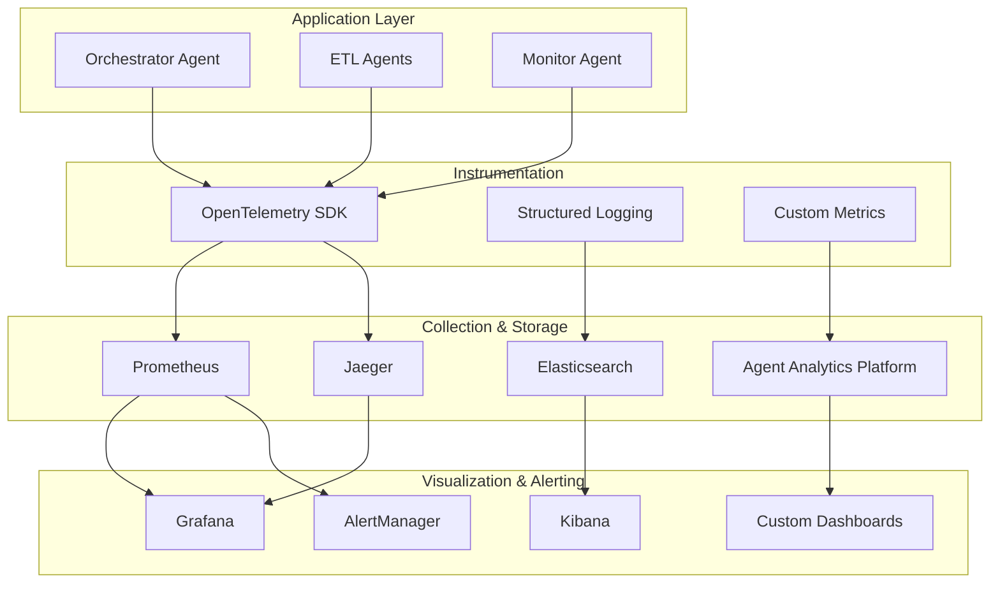

# ADR-004: Monitoring and Observability Approach

## Status
Proposed

## Context
The Agent-Orchestrated-ETL system requires comprehensive monitoring and observability to:
- Track agent decision-making effectiveness
- Monitor pipeline performance and reliability
- Detect anomalies and failures early
- Provide insights for system optimization
- Support debugging and troubleshooting
- Enable SLA monitoring and alerting

The system must observe both traditional infrastructure metrics and AI agent-specific behaviors.

## Options Considered

### Option 1: Prometheus + Grafana + ELK Stack
- **Pros**: Open source, mature ecosystem, flexible
- **Cons**: Complex setup, high maintenance overhead
- **Agent Observability**: Requires custom instrumentation

### Option 2: DataDog
- **Pros**: SaaS solution, excellent UX, comprehensive features
- **Cons**: High cost, vendor lock-in, limited customization
- **Agent Observability**: Good APM for agent tracing

### Option 3: New Relic
- **Pros**: Application-focused, good Python support, AI insights
- **Cons**: Expensive, complex pricing model
- **Agent Observability**: Strong APM capabilities

### Option 4: OpenTelemetry + Jaeger + Prometheus
- **Pros**: Vendor-neutral, comprehensive tracing, growing ecosystem
- **Cons**: Relatively new, complex configuration
- **Agent Observability**: Excellent for distributed agent tracing

### Option 5: Hybrid Approach (OpenTelemetry + Multiple Backends)
- **Pros**: Flexibility, vendor independence, best-of-breed
- **Cons**: Increased complexity, multiple systems to manage
- **Agent Observability**: Comprehensive coverage

## Decision
We choose a **Hybrid OpenTelemetry-based approach** with multiple specialized backends:

1. **OpenTelemetry** for instrumentation and data collection
2. **Prometheus** for metrics collection and alerting
3. **Jaeger** for distributed tracing
4. **Grafana** for visualization and dashboards
5. **ELK Stack** for log aggregation and analysis
6. **Custom Agent Analytics Platform** for AI-specific metrics

## Architecture Overview



## Key Monitoring Areas

### 1. Infrastructure Metrics
- CPU, memory, disk, network utilization
- Container/pod health and resource consumption
- Database connection pools and query performance
- Message queue depths and processing rates

### 2. Application Metrics
- Pipeline execution success/failure rates
- Processing throughput and latency
- Error rates and types
- API endpoint performance

### 3. Agent-Specific Metrics
- Decision-making latency and accuracy
- Agent coordination effectiveness
- LLM token usage and costs
- Agent state transitions and health

### 4. Business Metrics
- Data quality scores
- Pipeline SLA compliance
- Cost per pipeline execution
- User satisfaction metrics

## Implementation Details

### OpenTelemetry Instrumentation
```python
from opentelemetry import trace, metrics
from opentelemetry.exporter.jaeger.thrift import JaegerExporter
from opentelemetry.exporter.prometheus import PrometheusMetricReader
from opentelemetry.sdk.trace import TracerProvider
from opentelemetry.sdk.metrics import MeterProvider

# Trace configuration
trace.set_tracer_provider(TracerProvider())
tracer = trace.get_tracer(__name__)

# Metrics configuration
metric_reader = PrometheusMetricReader()
metrics.set_meter_provider(MeterProvider(metric_readers=[metric_reader]))
meter = metrics.get_meter(__name__)

# Custom metrics
pipeline_duration = meter.create_histogram(
    "pipeline_execution_duration_seconds",
    description="Time taken to execute pipelines",
    unit="s"
)

agent_decisions = meter.create_counter(
    "agent_decisions_total",
    description="Total number of agent decisions made",
)

# Usage in agent code
@tracer.start_as_current_span("orchestrator_decision")
def make_orchestration_decision(self, pipeline_request):
    span = trace.get_current_span()
    span.set_attribute("pipeline.source_type", pipeline_request.source_type)
    
    start_time = time.time()
    try:
        decision = self._analyze_and_decide(pipeline_request)
        span.set_attribute("decision.pipeline_type", decision.pipeline_type)
        agent_decisions.add(1, {"decision_type": decision.pipeline_type})
        return decision
    finally:
        duration = time.time() - start_time
        pipeline_duration.record(duration, {"source_type": pipeline_request.source_type})
```

### Agent Analytics Platform Schema
```python
class AgentDecisionMetric:
    timestamp: datetime
    agent_id: str
    decision_type: str
    input_complexity: float
    decision_latency: float
    confidence_score: float
    outcome_success: bool
    context_metadata: dict

class PipelineExecutionMetric:
    pipeline_id: str
    agent_decisions: List[AgentDecisionMetric]
    execution_duration: float
    data_volume_processed: int
    resource_utilization: dict
    error_count: int
    quality_score: float
```

### Alerting Rules
```yaml
# Prometheus alerting rules
groups:
  - name: agent_performance
    rules:
      - alert: AgentDecisionLatencyHigh
        expr: histogram_quantile(0.95, agent_decision_duration_seconds) > 10
        for: 5m
        labels:
          severity: warning
        annotations:
          summary: "Agent decision making is slow"
          
      - alert: PipelineFailureRateHigh
        expr: rate(pipeline_executions_failed_total[5m]) / rate(pipeline_executions_total[5m]) > 0.1
        for: 2m
        labels:
          severity: critical
        annotations:
          summary: "High pipeline failure rate detected"
          
      - alert: AgentCoordinationFailure
        expr: increase(agent_coordination_failures_total[5m]) > 0
        for: 1m
        labels:
          severity: critical
        annotations:
          summary: "Agent coordination system failure"
```

## Dashboard Strategy

### 1. Executive Dashboard
- Overall system health score
- Pipeline SLA compliance
- Cost trends and optimization opportunities
- Key business metrics

### 2. Operations Dashboard
- Real-time pipeline status
- System resource utilization
- Error rates and trending
- Performance metrics

### 3. Agent Performance Dashboard
- Agent decision accuracy and latency
- LLM usage and costs
- Agent coordination effectiveness
- Agent health and availability

### 4. Data Quality Dashboard
- Data validation results
- Schema evolution tracking
- Anomaly detection results
- Data freshness metrics

## Consequences

### Positive
- Comprehensive observability across all system layers
- Vendor-neutral approach prevents lock-in
- Excellent correlation between infrastructure, application, and agent metrics
- Strong foundation for ML-driven optimization
- Open-source components reduce licensing costs

### Negative
- Complex setup and configuration
- Multiple systems to maintain and operate
- Requires significant expertise across multiple tools
- Storage costs for high-volume telemetry data
- Potential performance impact from extensive instrumentation

### Agent-Specific Benefits
- Deep insights into agent decision-making patterns
- Ability to optimize agent performance based on data
- Early detection of agent coordination issues
- Cost tracking for LLM usage
- Foundation for agent behavior analysis and improvement

## Implementation Phases

### Phase 1: Basic Infrastructure Monitoring
- Deploy Prometheus, Grafana, and basic alerting
- Implement application metrics collection
- Set up log aggregation with ELK stack

### Phase 2: Agent Observability
- Implement OpenTelemetry instrumentation
- Deploy Jaeger for distributed tracing
- Create agent-specific metrics and dashboards

### Phase 3: Advanced Analytics
- Build agent analytics platform
- Implement ML-driven anomaly detection
- Create predictive alerting capabilities

### Phase 4: Optimization Integration
- Connect monitoring data to agent decision-making
- Implement auto-scaling based on metrics
- Enable self-healing capabilities

## Security and Privacy Considerations
- Secure metric endpoints and dashboards
- Anonymize sensitive data in traces and logs
- Implement proper access controls
- Regular security audits of monitoring infrastructure

## Related Decisions
- Builds on ADR-003 (Configuration Management) for monitoring configuration
- Influences ADR-005 (Security Architecture) for secure monitoring
- Supports optimization strategies from ADR-001 (Agent Framework)

## Review Date
This decision should be reviewed in Q4 2025 or if operational complexity becomes unmanageable.