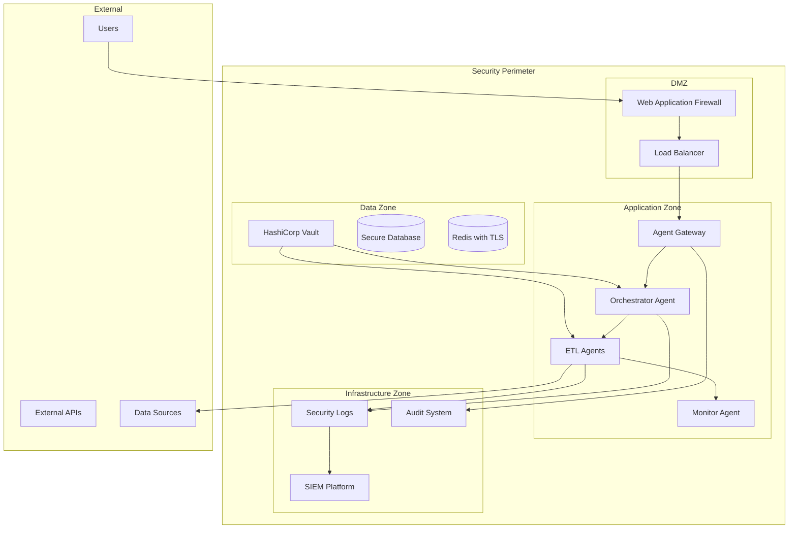

# ADR-005: Security Architecture

## Status
Proposed

## Context
The Agent-Orchestrated-ETL system handles sensitive data and requires a comprehensive security architecture that addresses:
- Agent-generated code execution security
- Data source credential management
- Network security and isolation
- Audit logging and compliance
- Input validation for dynamic pipeline generation
- Secure agent communication and coordination
- Protection against injection attacks in agent-generated queries

## Security Threat Model

### High-Risk Threats
1. **Code Injection via Agent Decisions**: Malicious input leading to dangerous code generation
2. **Credential Exposure**: Data source credentials leaked through logs or errors
3. **Lateral Movement**: Compromised agent affecting other system components
4. **Data Exfiltration**: Unauthorized access to sensitive pipeline data
5. **LLM Prompt Injection**: Manipulated prompts causing unintended agent behavior

### Medium-Risk Threats
1. Unauthorized pipeline modification
2. Agent coordination disruption
3. Resource exhaustion attacks
4. Configuration tampering
5. Monitoring system compromise

## Security Architecture Overview



## Core Security Components

### 1. Agent Sandbox Environment
```python
import docker
import tempfile
import os
from typing import Dict, Any, List
from dataclasses import dataclass

@dataclass
class SandboxConfig:
    memory_limit: str = "512m"
    cpu_limit: str = "0.5"
    network_mode: str = "none"
    read_only_root: bool = True
    allowed_syscalls: List[str] = None
    timeout_seconds: int = 300

class AgentSandbox:
    """Secure execution environment for agent-generated code"""
    
    def __init__(self, config: SandboxConfig):
        self.config = config
        self.docker_client = docker.from_env()
        
    def execute_agent_code(self, code: str, context: Dict[str, Any]) -> Any:
        """Execute agent-generated code in secure sandbox"""
        
        # 1. Code validation and sanitization
        validated_code = self._validate_code(code)
        
        # 2. Create secure execution environment
        with tempfile.TemporaryDirectory() as temp_dir:
            code_file = os.path.join(temp_dir, "agent_task.py")
            with open(code_file, 'w') as f:
                f.write(validated_code)
            
            # 3. Execute in Docker container
            container = self.docker_client.containers.run(
                image="python:3.11-alpine",
                command=f"python /code/agent_task.py",
                volumes={temp_dir: {'bind': '/code', 'mode': 'ro'}},
                memory=self.config.memory_limit,
                cpu_period=100000,
                cpu_quota=int(float(self.config.cpu_limit) * 100000),
                network_mode=self.config.network_mode,
                read_only=self.config.read_only_root,
                remove=True,
                detach=False,
                timeout=self.config.timeout_seconds
            )
            
            return self._parse_execution_result(container)
    
    def _validate_code(self, code: str) -> str:
        """Validate and sanitize agent-generated code"""
        # AST-based validation
        import ast
        
        try:
            tree = ast.parse(code)
        except SyntaxError:
            raise SecurityError("Invalid Python syntax in agent code")
        
        # Check for dangerous operations
        dangerous_nodes = []
        for node in ast.walk(tree):
            if isinstance(node, (ast.Import, ast.ImportFrom)):
                if self._is_dangerous_import(node):
                    dangerous_nodes.append(node)
            elif isinstance(node, ast.Call):
                if self._is_dangerous_call(node):
                    dangerous_nodes.append(node)
        
        if dangerous_nodes:
            raise SecurityError(f"Dangerous operations detected: {dangerous_nodes}")
        
        return code
    
    def _is_dangerous_import(self, node) -> bool:
        """Check if import is potentially dangerous"""
        dangerous_modules = {
            'os', 'subprocess', 'sys', 'socket', 'urllib',
            'requests', 'http', 'ftplib', 'smtplib'
        }
        
        if isinstance(node, ast.Import):
            return any(alias.name in dangerous_modules for alias in node.names)
        elif isinstance(node, ast.ImportFrom):
            return node.module in dangerous_modules
        
        return False
```

### 2. Credential Management System
```python
import hvac
from cryptography.fernet import Fernet
from typing import Dict, Optional
import boto3
from abc import ABC, abstractmethod

class CredentialProvider(ABC):
    @abstractmethod
    def get_credential(self, credential_id: str) -> Dict[str, str]:
        pass
    
    @abstractmethod
    def rotate_credential(self, credential_id: str) -> None:
        pass

class VaultCredentialProvider(CredentialProvider):
    """HashiCorp Vault integration for credential management"""
    
    def __init__(self, vault_url: str, auth_method: str):
        self.client = hvac.Client(url=vault_url)
        self._authenticate(auth_method)
        
    def get_credential(self, credential_id: str) -> Dict[str, str]:
        """Retrieve credential from Vault with audit logging"""
        try:
            response = self.client.secrets.kv.v2.read_secret_version(
                path=credential_id
            )
            
            # Log credential access for audit
            self._audit_log_access(credential_id)
            
            return response['data']['data']
        except Exception as e:
            self._audit_log_failure(credential_id, str(e))
            raise CredentialAccessError(f"Failed to retrieve credential {credential_id}")
    
    def rotate_credential(self, credential_id: str) -> None:
        """Rotate credential and update in Vault"""
        # Implementation depends on credential type
        # This would integrate with each data source's credential rotation API
        pass
    
    def _audit_log_access(self, credential_id: str):
        """Log credential access for security audit"""
        audit_event = {
            "event_type": "credential_access",
            "credential_id": credential_id,
            "timestamp": datetime.utcnow().isoformat(),
            "requester": self._get_current_context(),
            "action": "read"
        }
        logger.info("SECURITY_AUDIT", extra=audit_event)

class CredentialManager:
    """Centralized credential management with rotation and audit"""
    
    def __init__(self, provider: CredentialProvider):
        self.provider = provider
        self.encryption_key = self._load_encryption_key()
        
    def get_data_source_credentials(self, source_config: Dict) -> Dict:
        """Get credentials for data source with automatic decryption"""
        credential_id = source_config.get('credential_id')
        if not credential_id:
            raise SecurityError("No credential ID specified for data source")
        
        encrypted_creds = self.provider.get_credential(credential_id)
        return self._decrypt_credentials(encrypted_creds)
    
    def _decrypt_credentials(self, encrypted_creds: Dict) -> Dict:
        """Decrypt credentials using Fernet encryption"""
        fernet = Fernet(self.encryption_key)
        decrypted = {}
        for key, encrypted_value in encrypted_creds.items():
            if isinstance(encrypted_value, str) and encrypted_value.startswith('gAAAAAA'):
                decrypted[key] = fernet.decrypt(encrypted_value.encode()).decode()
            else:
                decrypted[key] = encrypted_value
        return decrypted
```

### 3. Input Validation and Sanitization
```python
from typing import Any, Dict, List
import re
import sqlparse
from sqlparse import sql, tokens

class InputValidator:
    """Comprehensive input validation for agent inputs"""
    
    def __init__(self):
        self.sql_injection_patterns = [
            r"(?i)(union\s+select)",
            r"(?i)(insert\s+into)",
            r"(?i)(update\s+\w+\s+set)",
            r"(?i)(delete\s+from)",
            r"(?i)(drop\s+table)",
            r"(?i)(alter\s+table)",
            r"(?i)(create\s+table)",
            r"(?i)(\'\s*;\s*)",
            r"(?i)(--\s*)",
            r"(?i)(/\*.*?\*/)",
        ]
        
    def validate_pipeline_config(self, config: Dict[str, Any]) -> Dict[str, Any]:
        """Validate and sanitize pipeline configuration"""
        validated_config = {}
        
        for key, value in config.items():
            # Validate key names
            if not self._is_valid_config_key(key):
                raise ValidationError(f"Invalid configuration key: {key}")
            
            # Validate and sanitize values
            validated_config[key] = self._sanitize_config_value(value)
        
        return validated_config
    
    def validate_sql_query(self, query: str) -> str:
        """Validate SQL query for injection attempts"""
        # Check for SQL injection patterns
        for pattern in self.sql_injection_patterns:
            if re.search(pattern, query):
                raise SecurityError(f"Potential SQL injection detected: {pattern}")
        
        # Parse and validate SQL structure
        try:
            parsed = sqlparse.parse(query)[0]
            if not self._is_safe_sql_statement(parsed):
                raise SecurityError("Unsafe SQL statement detected")
        except Exception as e:
            raise ValidationError(f"Invalid SQL syntax: {e}")
        
        return query
    
    def _is_safe_sql_statement(self, statement: sql.Statement) -> bool:
        """Check if SQL statement is safe for execution"""
        # Only allow SELECT statements for data extraction
        if statement.get_type() != 'SELECT':
            return False
        
        # Check for dangerous functions
        dangerous_functions = ['xp_cmdshell', 'sp_configure', 'openrowset']
        query_str = str(statement).lower()
        
        return not any(func in query_str for func in dangerous_functions)
    
    def _sanitize_config_value(self, value: Any) -> Any:
        """Sanitize configuration values"""
        if isinstance(value, str):
            # Remove potentially dangerous characters
            sanitized = re.sub(r'[<>"\';\\]', '', value)
            # Validate length
            if len(sanitized) > 1000:
                raise ValidationError("Configuration value too long")
            return sanitized
        elif isinstance(value, dict):
            return {k: self._sanitize_config_value(v) for k, v in value.items()}
        elif isinstance(value, list):
            return [self._sanitize_config_value(v) for v in value]
        else:
            return value
```

### 4. Network Security Configuration
```yaml
# Network segmentation and security policies
apiVersion: networking.k8s.io/v1
kind: NetworkPolicy
metadata:
  name: agent-network-policy
spec:
  podSelector:
    matchLabels:
      app: agent-orchestrated-etl
  policyTypes:
  - Ingress
  - Egress
  ingress:
  - from:
    - namespaceSelector:
        matchLabels:
          name: monitoring
    - podSelector:
        matchLabels:
          app: load-balancer
    ports:
    - protocol: TCP
      port: 8080
  egress:
  - to:
    - namespaceSelector:
        matchLabels:
          name: vault
    ports:
    - protocol: TCP
      port: 8200
  - to: []
    ports:
    - protocol: TCP
      port: 443  # HTTPS only for external APIs
```

## Security Controls Implementation

### 1. Authentication and Authorization
- **Service-to-Service**: mTLS certificates for agent communication
- **User Access**: OIDC integration with enterprise identity provider
- **API Access**: JWT tokens with short expiration and rotation
- **Data Source Access**: Service accounts with minimal required permissions

### 2. Audit Logging
```python
import structlog
from datetime import datetime
from typing import Dict, Any

class SecurityAuditLogger:
    def __init__(self):
        self.logger = structlog.get_logger("security.audit")
    
    def log_agent_decision(self, agent_id: str, decision_type: str, 
                          input_data: Dict, output_data: Dict):
        """Log agent decision for security audit"""
        self.logger.info(
            "agent_decision",
            agent_id=agent_id,
            decision_type=decision_type,
            input_hash=self._hash_sensitive_data(input_data),
            output_hash=self._hash_sensitive_data(output_data),
            timestamp=datetime.utcnow().isoformat()
        )
    
    def log_credential_access(self, credential_id: str, accessor: str):
        """Log credential access events"""
        self.logger.warning(
            "credential_access",
            credential_id=credential_id,
            accessor=accessor,
            timestamp=datetime.utcnow().isoformat()
        )
    
    def log_security_violation(self, violation_type: str, details: Dict):
        """Log security violations for immediate investigation"""
        self.logger.error(
            "security_violation",
            violation_type=violation_type,
            details=details,
            timestamp=datetime.utcnow().isoformat(),
            requires_investigation=True
        )
```

### 3. Data Protection
- **Encryption at Rest**: AES-256 encryption for all stored data
- **Encryption in Transit**: TLS 1.3 for all network communication
- **Data Masking**: Automatic PII detection and masking in logs
- **Data Retention**: Automated data purging based on retention policies

## Compliance Framework

### GDPR Compliance
- Data processing audit trails
- Right to erasure implementation
- Privacy impact assessments
- Data protection by design

### SOC 2 Type II
- Access control monitoring
- System availability tracking
- Processing integrity validation
- Confidentiality protection

### Industry-Specific
- HIPAA compliance for healthcare data
- PCI DSS for payment card data
- SOX compliance for financial data

## Consequences

### Positive
- Comprehensive protection against agent-specific security risks
- Strong credential management and rotation capabilities
- Extensive audit logging for compliance requirements
- Defense-in-depth security architecture
- Automated threat detection and response

### Negative
- Increased complexity in deployment and operations
- Performance overhead from security controls
- Additional infrastructure costs (Vault, SIEM, etc.)
- Learning curve for security-specific components
- Potential friction in development workflow

### Agent-Specific Benefits
- Secure execution of agent-generated code
- Protection against prompt injection attacks
- Comprehensive audit trail of agent decisions
- Isolation between agent components
- Secure agent coordination mechanisms

## Implementation Roadmap

### Phase 1: Core Security Infrastructure
- Deploy HashiCorp Vault for credential management
- Implement agent sandbox environment
- Set up security audit logging
- Configure network segmentation

### Phase 2: Advanced Protections
- Implement input validation and sanitization
- Deploy SIEM platform and automated alerting
- Add encryption for data at rest and in transit
- Implement compliance monitoring

### Phase 3: Threat Intelligence Integration
- Add threat detection and automated response
- Implement security metrics and KPIs
- Deploy vulnerability scanning automation
- Add penetration testing automation

### Phase 4: Advanced Compliance
- Implement privacy-preserving techniques
- Add automated compliance reporting
- Deploy advanced threat hunting capabilities
- Implement zero-trust architecture

## Security Testing Strategy
- Regular penetration testing of agent components
- Automated security scanning in CI/CD pipeline
- Red team exercises focusing on agent exploitation
- Compliance audits and assessments
- Security code reviews for all agent logic

## Incident Response Plan
1. **Detection**: Automated alerting and monitoring
2. **Containment**: Automatic agent isolation capabilities
3. **Investigation**: Comprehensive audit log analysis
4. **Recovery**: Automated system restoration procedures
5. **Lessons Learned**: Post-incident security improvements

## Related Decisions
- Builds on ADR-003 (Configuration Management) for secure configuration
- Integrates with ADR-004 (Monitoring) for security monitoring
- Influences all other ADRs regarding security requirements

## Review Date
This decision should be reviewed quarterly or immediately after any security incident.