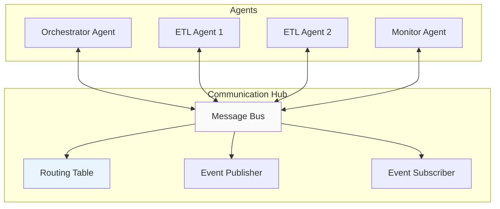
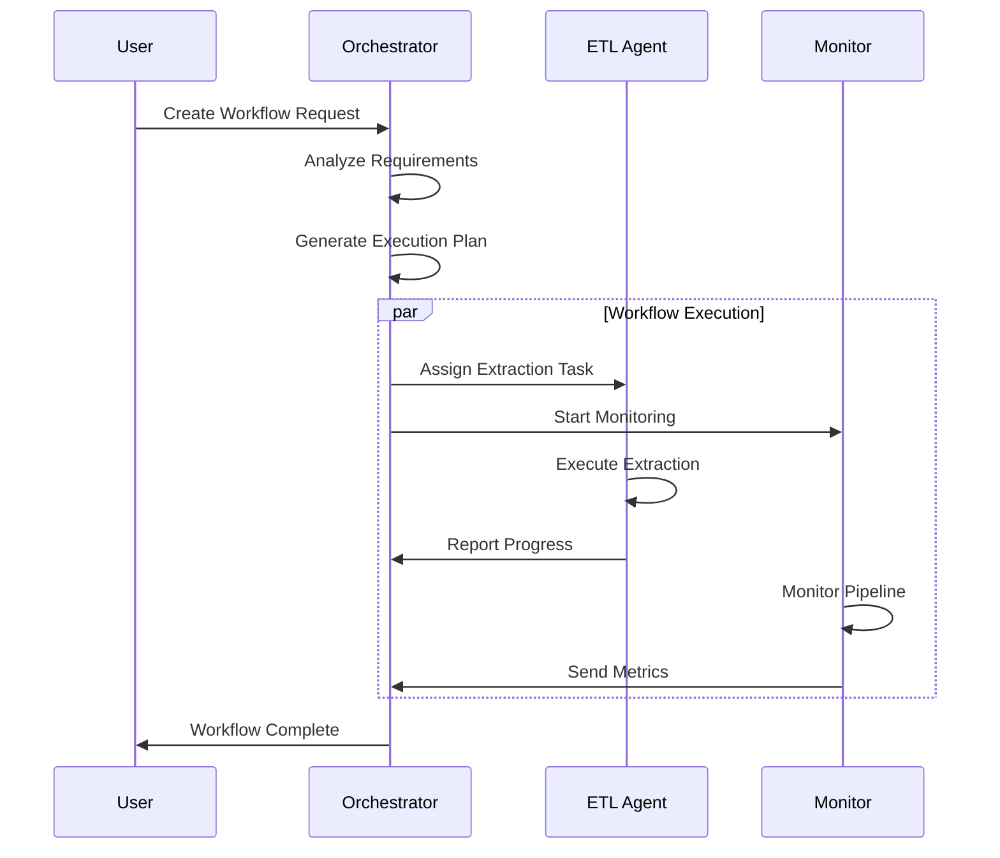
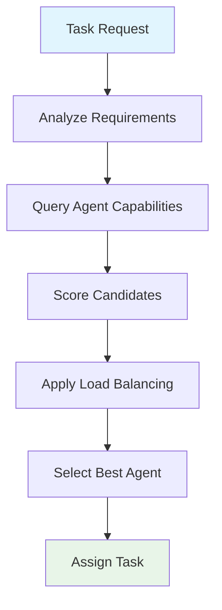
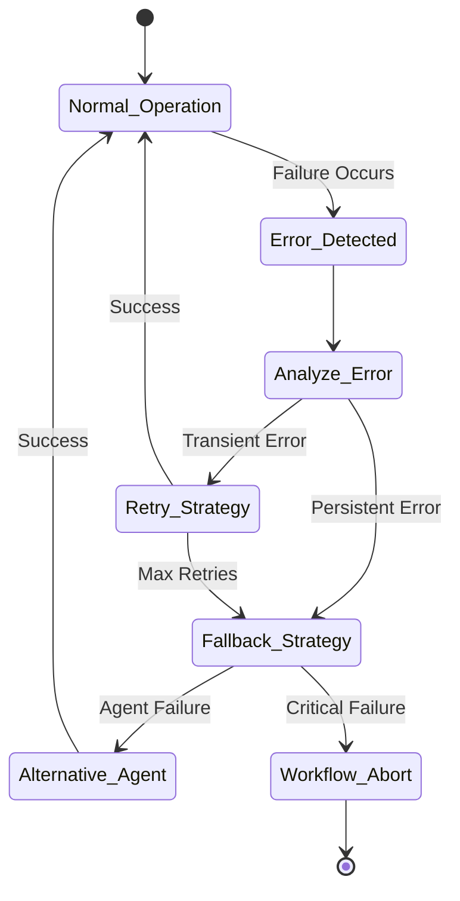
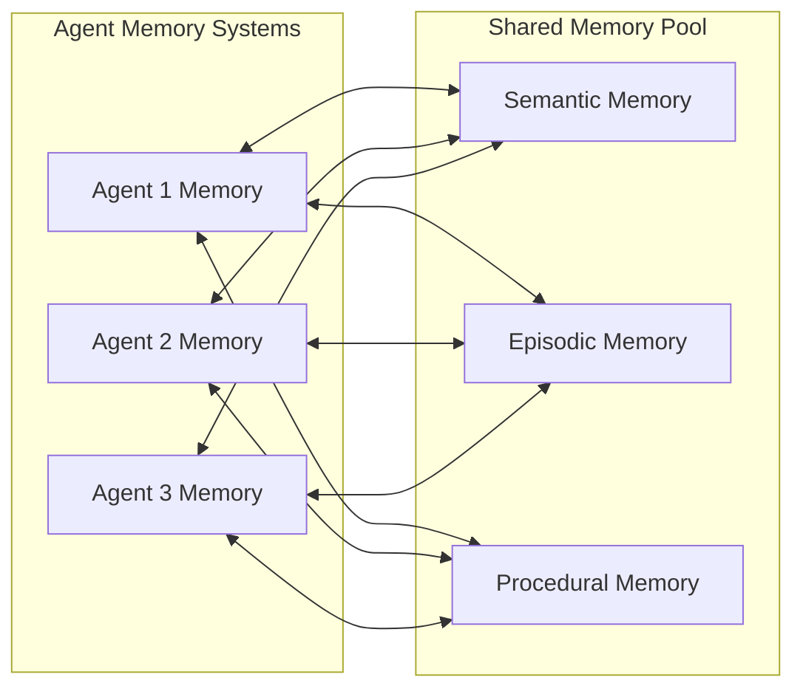
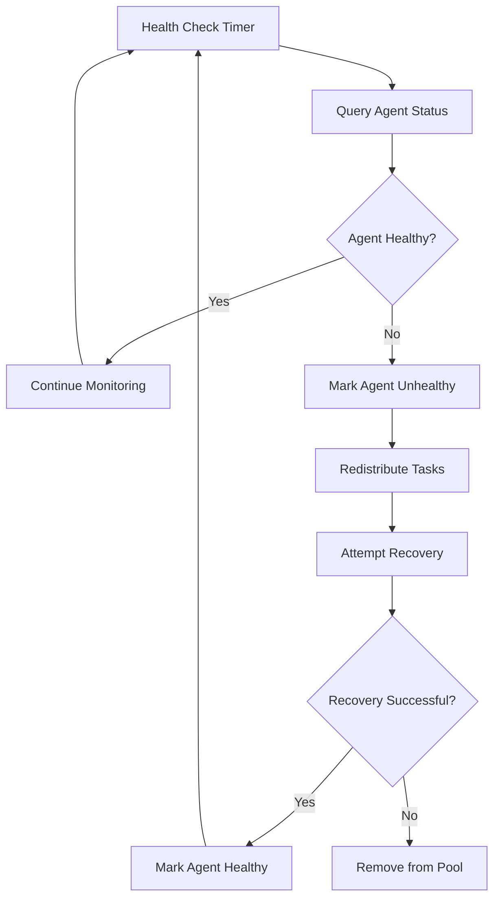
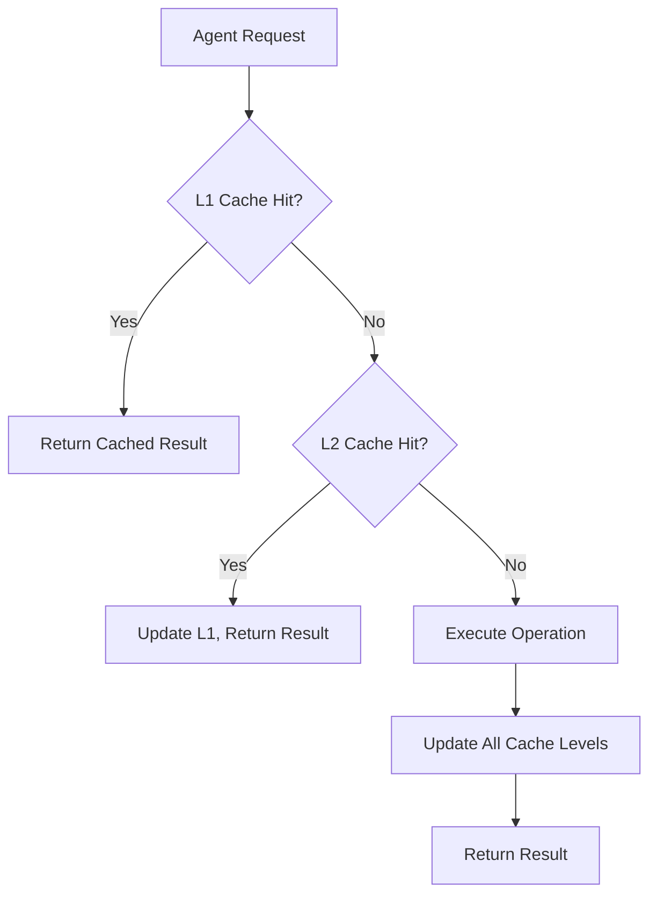
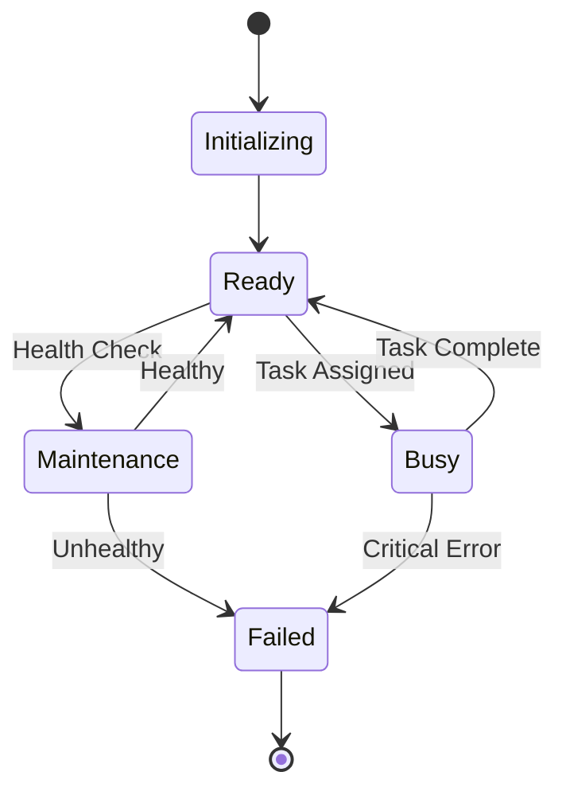

# Agent Interaction Patterns

## Overview

The Agent Orchestrated ETL system employs sophisticated interaction patterns between autonomous agents to achieve complex ETL workflows. This document details the communication protocols, coordination mechanisms, and interaction patterns used throughout the system.

## Communication Architecture

### Agent Communication Hub

The `AgentCommunicationHub` serves as the central nervous system for inter-agent communication.



**Key Components**:
- **Message Bus**: Handles message routing and delivery
- **Routing Table**: Maintains agent registry and capabilities
- **Event System**: Publishes and subscribes to system events

**Implementation**: `src/agent_orchestrated_etl/agents/communication.py`

### Message Types

#### 1. Task Assignment Messages
```python
{
    "message_type": "task_assignment",
    "source_agent": "orchestrator_001",
    "target_agent": "etl_worker_001", 
    "task": {
        "task_id": "extract_001",
        "task_type": "data_extraction",
        "description": "Extract customer data from PostgreSQL",
        "inputs": {
            "source": "postgresql://...",
            "query": "SELECT * FROM customers",
            "batch_size": 1000
        },
        "priority": 5,
        "deadline": 1753421600.0
    }
}
```

#### 2. Status Update Messages
```python
{
    "message_type": "status_update",
    "source_agent": "etl_worker_001",
    "target_agent": "orchestrator_001",
    "task_id": "extract_001",
    "status": "completed",
    "result": {
        "records_extracted": 10000,
        "extraction_time": 45.2,
        "data_quality_score": 0.95
    }
}
```

#### 3. Coordination Messages
```python
{
    "message_type": "coordination",
    "source_agent": "orchestrator_001",
    "broadcast": true,
    "coordination_type": "workflow_start",
    "workflow_id": "workflow_20250725_001",
    "participants": ["etl_worker_001", "etl_worker_002", "monitor_001"]
}
```

## Interaction Patterns

### 1. Workflow Orchestration Pattern

**Participants**: Orchestrator Agent, ETL Agents, Monitor Agent



**Implementation Details**:
- **Orchestrator Role**: Creates workflows, assigns tasks, monitors progress
- **ETL Agent Role**: Executes specific data operations, reports status
- **Monitor Agent Role**: Tracks performance, alerts on issues

### 2. Agent Selection Pattern

**Purpose**: Intelligent selection of the most suitable agent for a given task



**Selection Criteria**:
1. **Capability Matching**: Agent specialization alignment
2. **Performance History**: Past execution metrics
3. **Current Load**: Resource utilization levels
4. **Proximity**: Network/geographic considerations

**Implementation**: `src/agent_orchestrated_etl/agents/coordination.py:350`

### 3. Error Recovery Pattern

**Failure Detection and Recovery Flow**:



**Recovery Strategies**:
1. **Immediate Retry**: For transient network issues
2. **Agent Substitution**: For agent-specific failures  
3. **Workflow Rerouting**: For systematic issues
4. **Graceful Degradation**: For partial functionality

### 4. Memory Sharing Pattern

**Shared Knowledge and Learning**:



**Memory Types**:
- **Semantic Memory**: General knowledge and facts
- **Episodic Memory**: Specific events and experiences
- **Procedural Memory**: Skills and procedures  
- **Working Memory**: Temporary task-specific data

**Implementation**: `src/agent_orchestrated_etl/agents/memory.py`

## Coordination Mechanisms

### 1. Task Dependency Resolution

**Dependency Graph Processing**:

```python
# Example dependency resolution
workflow = {
    "tasks": [
        {"id": "extract", "depends_on": []},
        {"id": "transform", "depends_on": ["extract"]},
        {"id": "validate", "depends_on": ["transform"]},
        {"id": "load", "depends_on": ["validate"]}
    ]
}

# Orchestrator resolves dependencies and schedules execution
execution_order = orchestrator.resolve_dependencies(workflow)
# Result: ["extract", "transform", "validate", "load"]
```

### 2. Load Balancing

**Round-Robin with Capability Awareness**:

```python
class AgentLoadBalancer:
    def select_agent(self, task: AgentTask, available_agents: List[BaseAgent]) -> BaseAgent:
        # Filter by capability
        capable_agents = [agent for agent in available_agents 
                         if agent.can_handle(task)]
        
        # Apply load balancing
        return min(capable_agents, key=lambda a: a.current_load)
```

### 3. Event-Driven Coordination

**Event Types**:
- `workflow_started`: Broadcast workflow initiation
- `task_completed`: Signal task completion
- `agent_failure`: Alert to agent failures
- `resource_threshold`: Resource usage alerts

```python
# Event subscription example
@hub.subscribe("task_completed")
async def handle_task_completion(event: TaskCompletionEvent):
    if event.workflow_id in active_workflows:
        await orchestrator.update_workflow_progress(event)
```

## Quality Assurance Patterns

### 1. Circuit Breaker Pattern

**Implementation**: Prevents cascade failures when external services are unavailable

```python
@circuit_breaker(failure_threshold=5, recovery_timeout=60)
async def extract_from_api(self, api_config: Dict) -> Dict:
    # API extraction logic with automatic circuit breaking
    pass
```

### 2. Retry with Backoff

**Exponential Backoff Strategy**:

```python
@retry(max_attempts=3, backoff_strategy="exponential")
async def execute_task(self, task: AgentTask) -> TaskResult:
    # Task execution with automatic retry
    pass
```

### 3. Health Monitoring

**Agent Health Checks**:



## Performance Optimization Patterns

### 1. Async Task Batching

**Batch Multiple Small Tasks**:

```python
async def batch_execute_tasks(self, tasks: List[AgentTask]) -> List[TaskResult]:
    # Group similar tasks for efficient execution
    batches = self.group_tasks_by_type(tasks)
    results = []
    
    for batch in batches:
        batch_result = await self.execute_batch(batch)
        results.extend(batch_result)
    
    return results
```

### 2. Resource Pooling

**Connection Pool Management**:

```python
class DatabaseConnectionPool:
    def __init__(self, max_connections=10):
        self.pool = asyncio.Queue(maxsize=max_connections)
        self.active_connections = 0
    
    async def get_connection(self):
        if self.pool.empty() and self.active_connections < self.max_connections:
            return await self.create_connection()
        return await self.pool.get()
```

### 3. Caching Strategies

**Multi-Level Caching**:



## Monitoring and Observability

### 1. Agent Lifecycle Tracking

**State Transitions**:



### 2. Performance Metrics Collection

**Key Metrics**:
- Task execution time
- Success/failure rates
- Resource utilization
- Queue depths
- Response times

### 3. Real-time Monitoring

**WebSocket-based Updates**:

```python
# Real-time monitoring implementation
class MonitoringWebSocketServer:
    async def broadcast_metrics(self, metrics: Dict):
        for client in self.connected_clients:
            await client.send(json.dumps(metrics))
```

## Security Considerations

### 1. Agent Authentication

**JWT-based Agent Identity**:

```python
class AgentAuthenticator:
    def verify_agent_token(self, token: str) -> AgentIdentity:
        # Verify JWT token and extract agent identity
        payload = jwt.decode(token, self.secret_key, algorithms=["HS256"])
        return AgentIdentity.from_payload(payload)
```

### 2. Message Security

**Message Encryption and Signing**:

```python
class SecureMessage:
    def __init__(self, content: Dict, sender: AgentIdentity):
        self.content = self.encrypt(content)
        self.signature = self.sign(content, sender.private_key)
        self.sender_id = sender.agent_id
```

### 3. Access Control

**Role-Based Agent Permissions**:

```python
@require_role(AgentRole.ORCHESTRATOR)
async def create_workflow(self, workflow_spec: Dict) -> str:
    # Only orchestrator agents can create workflows
    pass
```

---

*Last Updated: 2025-07-25*  
*Document Version: 1.0*  
*Maintained by: Terragon Labs - Agent Orchestrated ETL Team*