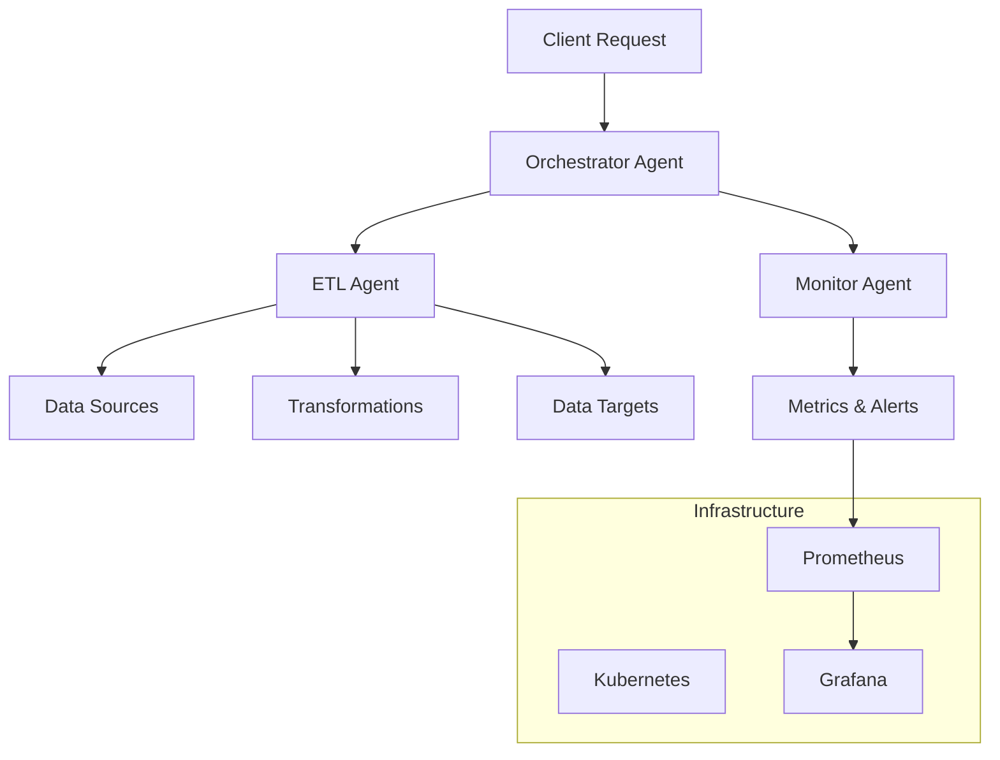

# Agent Orchestrated ETL

Welcome to the Agent Orchestrated ETL documentation! This project combines the power of Apache Airflow with LangChain to create an intelligent, agent-driven ETL pipeline system.

## Overview

Agent Orchestrated ETL is a hybrid system that leverages AI agents to make intelligent decisions about ETL operations, data processing, and workflow orchestration. It provides:

- **Intelligent Agent Coordination** - AI agents that decide which ETL steps to execute
- **Dynamic Pipeline Generation** - Airflow DAGs generated based on agent decisions
- **Real-time Monitoring** - Comprehensive observability and alerting
- **Scalable Architecture** - Kubernetes-ready with auto-scaling capabilities

## Key Features

### 🤖 Intelligent Agents
- **ETL Agents** - Handle extraction, transformation, and loading operations
- **Monitor Agents** - Provide real-time system monitoring and alerting
- **Orchestrator Agents** - Coordinate complex multi-agent workflows

### 📊 Advanced ETL Operations
- **Multi-source Data Extraction** - APIs, databases, files, and streaming data
- **Intelligent Transformations** - AI-powered data cleaning and enrichment
- **Flexible Loading** - Support for various data warehouses and lakes

### 🔍 Observability & Monitoring
- **Real-time Dashboards** - Grafana-based visualization
- **Custom Metrics** - Prometheus integration with custom metrics
- **Distributed Tracing** - OpenTelemetry for end-to-end visibility

### 🚀 Production Ready
- **Container Support** - Docker and Kubernetes deployment
- **Infrastructure as Code** - Terraform modules included
- **CI/CD Integration** - GitHub Actions workflows
- **Security First** - RBAC, secret management, and compliance

## Quick Start

Get started with Agent Orchestrated ETL in under 5 minutes:

```bash
# Clone the repository
git clone https://github.com/terragon-labs/agent-orchestrated-etl.git
cd agent-orchestrated-etl

# Install dependencies
pip install -e .[dev]

# Run your first pipeline
python -m agent_orchestrated_etl.cli run-pipeline --config examples/basic.yml
```

For detailed installation instructions, see our [Quick Start Guide](guides/quick-start.md).

## Architecture

The system is built with a modular, agent-centric architecture:



Learn more about the [System Architecture](architecture/system-overview.md).

## Use Cases

Agent Orchestrated ETL is perfect for:

- **Data Engineering Teams** - Streamline complex ETL pipelines
- **ML Operations** - Intelligent data preparation for ML workflows  
- **Real-time Analytics** - Event-driven data processing
- **Data Integration** - Connect disparate data sources intelligently

## Community & Support

- 📖 [Documentation](https://terragon-labs.github.io/agent-orchestrated-etl/)
- 💬 [GitHub Discussions](https://github.com/terragon-labs/agent-orchestrated-etl/discussions)
- 🐛 [Issue Tracker](https://github.com/terragon-labs/agent-orchestrated-etl/issues)
- 🔒 [Security Policy](SECURITY.md)

## Contributing

We welcome contributions! Please see our [Contributing Guide](CONTRIBUTING.md) for details on:

- Code style and standards
- Testing requirements
- Pull request process
- Community guidelines

## License

This project is licensed under the MIT License - see the [LICENSE](LICENSE) file for details.

---

**Ready to get started?** Check out our [Quick Start Guide](guides/quick-start.md) or dive into the [API Reference](api/agents.md).