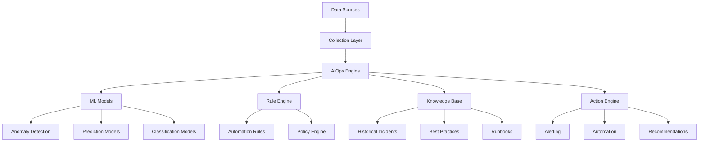

# AIOps Integration Strategy for Agent-Orchestrated ETL

## Overview

This document outlines the integration of Artificial Intelligence for IT Operations (AIOps) capabilities into our agent-orchestrated ETL system, enabling intelligent automation, predictive maintenance, and autonomous problem resolution.

## Current AIOps Capabilities

### 1. Intelligent Monitoring & Alerting

**Anomaly Detection**
- ML-based detection of unusual pipeline behavior
- Statistical analysis of performance metrics
- Automatic baseline establishment and drift detection
- Context-aware alerting with noise reduction

**Root Cause Analysis**
- Correlation analysis across multiple data sources
- Dependency mapping for impact assessment
- Historical pattern matching for similar incidents
- Automated evidence collection and presentation

### 2. Predictive Maintenance

**Failure Prediction**
- Resource exhaustion forecasting
- Component wear-out pattern recognition  
- Capacity planning recommendations
- Proactive maintenance scheduling

**Performance Optimization**
- Resource utilization pattern analysis
- Query performance trend analysis
- Infrastructure right-sizing recommendations
- Cost optimization opportunities identification

### 3. Autonomous Remediation

**Self-Healing Capabilities**
- Automatic pipeline restart on transient failures
- Dynamic resource allocation based on load
- Circuit breaker implementation for failing dependencies
- Graceful degradation strategies

**Intelligent Scaling**
- ML-based workload prediction
- Proactive resource provisioning
- Cost-aware scaling decisions
- Multi-dimensional scaling (CPU, memory, storage, network)

## Implementation Architecture



## Key Components

### AIOps Data Pipeline

**Metrics Collection**
- System metrics (CPU, memory, disk, network)
- Application metrics (throughput, latency, errors)
- Business metrics (data quality, pipeline SLAs)
- Log aggregation and parsing
- Distributed tracing data

**Feature Engineering**
- Time-series feature extraction
- Seasonal decomposition
- Lag feature creation
- Correlation analysis
- Dimensionality reduction

**Model Training Pipeline**
- Automated model selection
- Hyperparameter optimization
- Cross-validation and backtesting
- Model versioning and deployment
- A/B testing for model performance

### Machine Learning Models

**Anomaly Detection Models**
```python
# Isolation Forest for multivariate anomaly detection
from sklearn.ensemble import IsolationForest

class AnomalyDetector:
    def __init__(self):
        self.model = IsolationForest(
            contamination=0.1,
            random_state=42
        )
    
    def detect_anomalies(self, metrics):
        """Detect anomalies in system metrics."""
        anomaly_scores = self.model.decision_function(metrics)
        anomalies = self.model.predict(metrics) == -1
        return anomalies, anomaly_scores
```

**Predictive Models**
```python
# LSTM for time series prediction
import tensorflow as tf

class WorkloadPredictor:
    def __init__(self):
        self.model = tf.keras.Sequential([
            tf.keras.layers.LSTM(50, return_sequences=True),
            tf.keras.layers.LSTM(50),
            tf.keras.layers.Dense(25),
            tf.keras.layers.Dense(1)
        ])
    
    def predict_workload(self, historical_data, horizon=24):
        """Predict workload for next N hours."""
        return self.model.predict(historical_data)
```

**Classification Models**
```python
# Random Forest for incident classification
from sklearn.ensemble import RandomForestClassifier

class IncidentClassifier:
    def __init__(self):
        self.model = RandomForestClassifier(
            n_estimators=100,
            max_depth=10,
            random_state=42
        )
    
    def classify_incident(self, incident_features):
        """Classify incident type and severity."""
        incident_type = self.model.predict(incident_features)
        confidence = self.model.predict_proba(incident_features)
        return incident_type, confidence
```

## Advanced AIOps Use Cases

### 1. Intelligent Data Quality Monitoring

**Data Drift Detection**
- Statistical tests for distribution changes
- Schema evolution tracking
- Data freshness monitoring
- Completeness and consistency checks

**Quality Score Prediction**
- ML models to predict data quality metrics
- Proactive quality issue identification
- Root cause analysis for quality degradation
- Automated data validation rule generation

### 2. Pipeline Optimization

**Resource Allocation Optimization**
- Multi-objective optimization (cost, performance, reliability)
- Genetic algorithms for configuration tuning
- Reinforcement learning for adaptive policies
- Constraint satisfaction for SLA compliance

**Query Optimization**
- SQL query performance prediction
- Index recommendation engine
- Partition strategy optimization
- Caching strategy recommendations

### 3. Capacity Planning

**Growth Prediction**
- Data volume growth forecasting
- User growth impact analysis
- Seasonal pattern recognition
- Infrastructure scaling recommendations

**Cost Optimization**
- TCO prediction models
- Reserved vs. on-demand optimization
- Multi-cloud cost comparison
- Carbon footprint optimization

## Integration Points

### Existing Systems Integration

**Monitoring Stack**
```yaml
# Prometheus integration
prometheus:
  aiops_metrics:
    - anomaly_scores
    - prediction_accuracy
    - model_drift_metrics
    - automation_success_rate

# Grafana dashboards
grafana:
  aiops_dashboards:
    - anomaly_detection
    - predictive_insights
    - automation_actions
    - model_performance
```

**Alerting Integration**
```yaml
# PagerDuty integration
pagerduty:
  intelligent_routing:
    - skill_based_routing
    - severity_prediction
    - escalation_optimization
    - context_enrichment

# Slack integration
slack:
  ai_assistant:
    - natural_language_queries
    - incident_summarization
    - recommendation_delivery
    - status_updates
```

### CI/CD Integration

**MLOps Pipeline**
```yaml
# GitHub Actions for ML model deployment
name: AIOps Model Deployment
on:
  push:
    paths: ['models/**']

jobs:
  validate_model:
    steps:
      - name: Model Validation
        run: python validate_model_performance.py
      
      - name: A/B Test Setup
        run: python setup_ab_test.py
      
      - name: Gradual Rollout
        run: python gradual_model_rollout.py
```

## Implementation Roadmap

### Phase 1: Foundation (Months 1-3)
- [ ] Data collection infrastructure
- [ ] Basic anomaly detection
- [ ] Simple automation rules
- [ ] Monitoring dashboard

### Phase 2: Intelligence (Months 4-6)
- [ ] ML model development
- [ ] Predictive capabilities
- [ ] Advanced automation
- [ ] Root cause analysis

### Phase 3: Optimization (Months 7-9)
- [ ] Multi-model ensemble
- [ ] Reinforcement learning
- [ ] Advanced optimization
- [ ] Self-tuning systems

### Phase 4: Innovation (Months 10-12)
- [ ] Natural language interfaces
- [ ] Autonomous operations
- [ ] Causal inference
- [ ] Explainable AI

## Success Metrics

### Operational Metrics
- **MTTR Reduction**: Target 50% reduction in mean time to resolution
- **False Positive Rate**: Maintain < 5% false positive rate for alerts
- **Automation Coverage**: Achieve 80% automation for routine operations
- **Prediction Accuracy**: Maintain > 90% accuracy for critical predictions

### Business Metrics
- **Cost Savings**: Target 20% reduction in operational costs
- **SLA Compliance**: Improve SLA compliance to 99.9%
- **Developer Productivity**: Reduce ops burden by 60%
- **Innovation Velocity**: Enable 2x faster feature delivery

### Technical Metrics
- **Model Performance**: Maintain F1 score > 0.85 for all models
- **Data Quality**: Achieve 99.5% data quality score
- **System Reliability**: Target 99.99% system availability
- **Security Posture**: Zero security incidents from AIOps actions

## Risk Mitigation

### Model Risk Management
- Regular model validation and retraining
- A/B testing for model changes
- Fallback mechanisms for model failures
- Human oversight for critical decisions

### Operational Risk
- Gradual automation rollout
- Circuit breakers for automation
- Manual override capabilities
- Comprehensive audit logging

### Security Considerations
- Model bias detection and mitigation
- Adversarial attack protection
- Data privacy compliance
- Access control for AI systems

## Future Innovations

### Emerging Technologies
- **Large Language Models**: Natural language operations interface
- **Graph Neural Networks**: Complex dependency modeling
- **Federated Learning**: Privacy-preserving model training
- **Quantum Computing**: Optimization problem solving

### Advanced Capabilities
- **Causal AI**: Understanding cause-effect relationships
- **Autonomous Agents**: Self-managing infrastructure
- **Digital Twins**: Virtual system replicas for testing
- **Neuromorphic Computing**: Brain-inspired processing

## Conclusion

The integration of AIOps capabilities represents a strategic evolution toward autonomous, intelligent operations. By combining machine learning, automation, and domain expertise, we can achieve unprecedented levels of reliability, efficiency, and innovation in our ETL operations.

The roadmap outlined above provides a structured approach to implementing these capabilities while managing risks and ensuring measurable business value. Regular review and adaptation of this strategy will be essential as the field of AIOps continues to evolve rapidly.