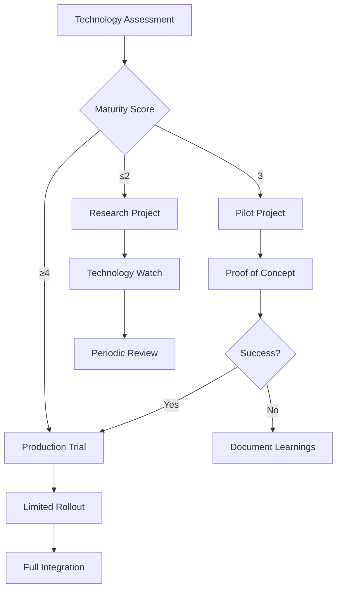

# Emerging Technology Evaluation Framework

## Overview

This document establishes a systematic framework for evaluating and integrating emerging technologies into the agent-orchestrated ETL system. The goal is to maintain technological leadership while ensuring practical business value and manageable implementation risks.

## Evaluation Framework

### Technology Assessment Matrix

| Criteria | Weight | Score (1-5) | Weighted Score |
|----------|--------|-------------|----------------|
| **Technical Maturity** | 20% | - | - |
| **Business Value** | 25% | - | - |
| **Implementation Complexity** | 15% | - | - |
| **Risk Level** | 10% | - | - |
| **Strategic Alignment** | 15% | - | - |
| **Ecosystem Support** | 10% | - | - |
| **Cost/Benefit Ratio** | 5% | - | - |

### Evaluation Process


## Current Technology Radar

### Adopt (High Confidence, Ready for Production)

#### 1. WebAssembly (WASM) for Data Processing
**Maturity**: Production Ready
**Business Value**: High performance, security isolation
**Use Case**: Custom data transformation functions

```python
# Example WASM integration for ETL transformations
import wasmtime

class WASMTransformer:
    def __init__(self, wasm_module_path):
        self.engine = wasmtime.Engine()
        self.module = wasmtime.Module.from_file(self.engine, wasm_module_path)
        self.store = wasmtime.Store(self.engine)
        self.instance = wasmtime.Instance(self.store, self.module, [])
    
    def transform_data(self, data):
        """Execute WASM transformation on data."""
        transform_func = self.instance.exports(self.store)["transform"]
        return transform_func(self.store, data)
```

#### 2. Apache Arrow for In-Memory Analytics
**Maturity**: Production Ready
**Business Value**: 10-100x performance improvement
**Use Case**: High-performance data interchange

```python
# Arrow integration for columnar processing
import pyarrow as pa
import pyarrow.compute as pc

class ArrowProcessor:
    def __init__(self):
        self.memory_pool = pa.default_memory_pool()
    
    def process_batch(self, data_batch):
        """Process data using Arrow compute functions."""
        table = pa.table(data_batch)
        
        # Vectorized operations
        filtered = pc.filter(table, pc.greater(table['value'], 100))
        aggregated = pc.group_by(filtered, ['category']).aggregate([
            ('value', 'sum'),
            ('count', 'count')
        ])
        
        return aggregated.to_pandas()
```

### Trial (Promising, Limited Production Use)

#### 1. Ray for Distributed Computing
**Maturity**: Early Production
**Business Value**: Scalable ML and data processing
**Use Case**: Large-scale model training and inference

```python
# Ray integration for distributed ETL processing
import ray
from ray import tune

@ray.remote
class ETLWorker:
    def __init__(self, config):
        self.config = config
    
    def process_partition(self, data_partition):
        """Process data partition in parallel."""
        # ETL logic here
        return processed_data

class DistributedETL:
    def __init__(self, num_workers=4):
        ray.init()
        self.workers = [ETLWorker.remote(config) for _ in range(num_workers)]
    
    def process_dataset(self, dataset):
        """Process dataset using distributed workers."""
        partitions = self._partition_dataset(dataset)
        futures = [
            worker.process_partition.remote(partition)
            for worker, partition in zip(self.workers, partitions)
        ]
        return ray.get(futures)
```

#### 2. DuckDB for Analytical Workloads
**Maturity**: Stable, Growing Adoption
**Business Value**: Embedded OLAP with SQL interface
**Use Case**: Fast analytical queries on structured data

```python
# DuckDB integration for fast analytics
import duckdb

class AnalyticalEngine:
    def __init__(self):
        self.conn = duckdb.connect(':memory:')
        
    def analyze_data(self, data_path):
        """Perform analytical queries on data."""
        # Direct querying of Parquet files
        query = """
        SELECT 
            category,
            COUNT(*) as record_count,
            AVG(value) as avg_value,
            PERCENTILE_CONT(0.95) WITHIN GROUP (ORDER BY value) as p95_value
        FROM read_parquet('{}')
        GROUP BY category
        ORDER BY record_count DESC
        """.format(data_path)
        
        return self.conn.execute(query).fetchdf()
```

### Assess (Experimental, Proof of Concept Only)

#### 1. Large Language Models for ETL Generation
**Maturity**: Experimental
**Business Value**: Automated pipeline generation
**Risk**: Hallucination, reliability concerns

```python
# LLM integration for pipeline generation
from langchain.llms import OpenAI
from langchain.prompts import PromptTemplate

class PipelineGenerator:
    def __init__(self):
        self.llm = OpenAI(temperature=0)
        self.prompt_template = PromptTemplate(
            input_variables=["source_schema", "target_schema", "requirements"],
            template="""
            Generate an ETL pipeline that transforms data from:
            Source Schema: {source_schema}
            Target Schema: {target_schema}
            Requirements: {requirements}
            
            Provide Python code using our ETL framework.
            """
        )
    
    def generate_pipeline(self, source_schema, target_schema, requirements):
        """Generate ETL pipeline using LLM."""
        prompt = self.prompt_template.format(
            source_schema=source_schema,
            target_schema=target_schema,
            requirements=requirements
        )
        
        generated_code = self.llm(prompt)
        return self._validate_and_clean_code(generated_code)
```

#### 2. Quantum Computing for Optimization
**Maturity**: Research Phase
**Business Value**: Exponential speedup for specific problems
**Risk**: Hardware limitations, algorithm complexity

```python
# Quantum optimization for resource allocation
from qiskit import QuantumCircuit, execute, Aer
from qiskit.optimization import QuadraticProgram
from qiskit.optimization.algorithms import MinimumEigenOptimizer

class QuantumOptimizer:
    def __init__(self):
        self.backend = Aer.get_backend('qasm_simulator')
    
    def optimize_resource_allocation(self, constraints, objectives):
        """Use quantum optimization for resource allocation."""
        # Define quadratic program
        qp = QuadraticProgram()
        
        # Add variables and constraints
        for i, resource in enumerate(constraints['resources']):
            qp.binary_var(f'x{i}')
        
        # Add objective function
        qp.minimize(objectives['cost_function'])
        
        # Solve using quantum algorithm
        optimizer = MinimumEigenOptimizer(self._get_quantum_algorithm())
        result = optimizer.solve(qp)
        
        return result
```

### Hold (Not Ready, Monitor Progress)

#### 1. Neuromorphic Computing
**Maturity**: Research Phase
**Rationale**: Limited hardware availability, unclear ETL applications

#### 2. Blockchain for Data Lineage
**Maturity**: Concept Phase  
**Rationale**: Performance overhead, unclear value proposition

## Technology Integration Guidelines

### Assessment Criteria Detail

#### Technical Maturity
- **Level 5**: Production-ready, stable APIs, extensive documentation
- **Level 4**: Beta quality, minor API changes expected
- **Level 3**: Alpha quality, significant changes possible
- **Level 2**: Experimental, proof-of-concept quality
- **Level 1**: Research prototype, unstable

#### Business Value Assessment
- **Direct Cost Savings**: Quantifiable reduction in operational costs
- **Performance Improvements**: Measurable latency, throughput gains
- **Developer Productivity**: Reduced development/maintenance time
- **Competitive Advantage**: Unique capabilities vs. competitors
- **Risk Mitigation**: Reduced system risks or compliance benefits

#### Implementation Strategy



### Risk Management

#### Technical Risks
- **Vendor Lock-in**: Evaluate open standards and portability
- **Security Vulnerabilities**: Assess security model and update frequency
- **Performance Regression**: Establish baseline metrics and monitoring
- **Integration Complexity**: Estimate integration effort and maintenance cost

#### Business Risks
- **ROI Uncertainty**: Define success metrics and measurement timeline
- **Resource Allocation**: Assess team skill gaps and training needs
- **Opportunity Cost**: Compare against alternative investments
- **Market Timing**: Consider adoption lifecycle and competitive dynamics

## Innovation Pipeline

### Current Investigations (Q3-Q4 2025)

#### 1. Edge Computing for Data Processing
**Investigation Lead**: Platform Team
**Timeline**: 6 months
**Budget**: $50K
**Success Criteria**: 
- 50% reduction in data transfer costs
- <100ms processing latency
- 99.9% edge node availability

#### 2. Homomorphic Encryption for Privacy-Preserving Analytics
**Investigation Lead**: Security Team
**Timeline**: 9 months
**Budget**: $75K
**Success Criteria**:
- Process encrypted data without decryption
- <10x performance overhead vs. plaintext
- Regulatory compliance validation

#### 3. Graph Databases for Lineage Tracking
**Investigation Lead**: Architecture Team
**Timeline**: 4 months
**Budget**: $30K
**Success Criteria**:
- Complex lineage queries <1s response time
- Support for 1M+ data assets
- Visual lineage representation

### Future Research Areas (2026+)

#### Emerging AI/ML Technologies
- **Causal AI**: Understanding cause-effect relationships in data pipelines
- **Federated Learning**: Privacy-preserving model training across organizations
- **Neural Architecture Search**: Automated ML model optimization
- **Explainable AI**: Interpretable model decisions for regulatory compliance

#### Advanced Computing Paradigms
- **Serverless Computing Evolution**: Function-as-a-Service for ETL components
- **Container Orchestration**: Advanced Kubernetes patterns for data workloads
- **Mesh Computing**: Distributed processing across edge-cloud continuum
- **Green Computing**: Energy-efficient data processing architectures

#### Data Management Innovations
- **Data Mesh Architecture**: Decentralized data ownership and governance
- **Real-time Data Virtualization**: Live views across distributed data sources
- **Automated Data Discovery**: AI-powered data asset cataloging
- **Self-Healing Data Pipelines**: Autonomous error detection and recovery

## Evaluation Templates

### Technology Assessment Template

```markdown
# Technology Assessment: [Technology Name]

## Executive Summary
- **Recommendation**: Adopt/Trial/Assess/Hold
- **Timeline**: [Implementation timeline]
- **Investment**: [Required investment]
- **ROI**: [Expected return on investment]

## Technical Analysis
- **Maturity Level**: [1-5 scale]
- **Performance Characteristics**: [Benchmarks, comparisons]
- **Integration Requirements**: [Dependencies, compatibility]
- **Security Considerations**: [Security model, vulnerabilities]

## Business Case
- **Problem Statement**: [What problem does this solve?]
- **Success Metrics**: [How will success be measured?]
- **Risk Assessment**: [Technical and business risks]
- **Alternative Solutions**: [Other options considered]

## Implementation Plan
- **Phase 1**: [Initial steps]
- **Phase 2**: [Scaling approach]
- **Phase 3**: [Full integration]
- **Success Criteria**: [Go/no-go decisions]

## Resource Requirements
- **Team**: [Required skills and roles]
- **Budget**: [Detailed cost breakdown]
- **Timeline**: [Milestones and dependencies]
- **Infrastructure**: [Hardware/software needs]
```

### Proof of Concept Template

```markdown
# PoC Plan: [Technology Name]

## Objectives
- **Primary Goal**: [Main objective]
- **Success Criteria**: [Measurable outcomes]
- **Timeline**: [Duration and milestones]

## Scope
- **In Scope**: [What will be tested]
- **Out of Scope**: [What won't be tested]
- **Assumptions**: [Key assumptions]

## Technical Approach
- **Architecture**: [High-level design]
- **Implementation**: [Key components]
- **Testing Strategy**: [How success will be validated]

## Resource Plan
- **Team Members**: [Roles and responsibilities]
- **Budget**: [Cost estimate]
- **Infrastructure**: [Required resources]

## Risk Mitigation
- **Technical Risks**: [Identified risks and mitigations]
- **Schedule Risks**: [Timeline risks and buffers]
- **Resource Risks**: [Availability and skill gaps]

## Success Metrics
- **Performance**: [Speed, throughput, accuracy metrics]
- **Quality**: [Reliability, maintainability measures]
- **Business**: [Cost, time-to-value metrics]
```

## Conclusion

This framework ensures systematic evaluation of emerging technologies while balancing innovation with practical business needs. Regular updates to the technology radar and continuous monitoring of the innovation pipeline will keep our ETL system at the forefront of technological advancement.

The key to success is maintaining a balance between:
- **Innovation**: Staying ahead of technological trends
- **Pragmatism**: Focusing on business value and practical implementation
- **Risk Management**: Avoiding bleeding-edge technologies that could destabilize operations
- **Continuous Learning**: Building organizational capability to evaluate and adopt new technologies

Regular quarterly reviews of this framework and the technology radar will ensure we remain responsive to the rapidly evolving technology landscape while making informed investment decisions.